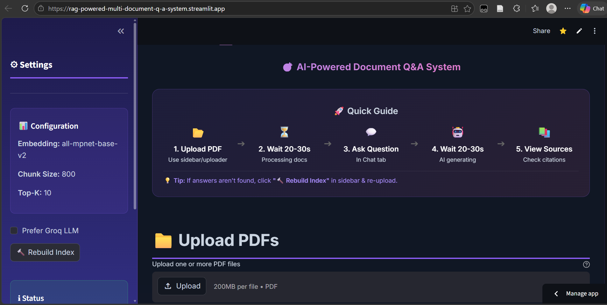
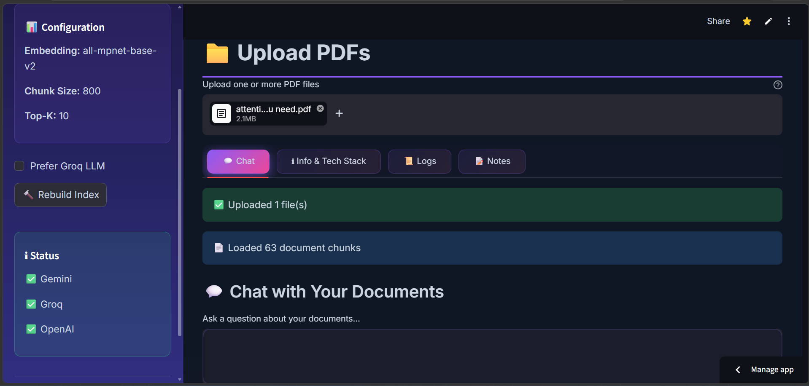
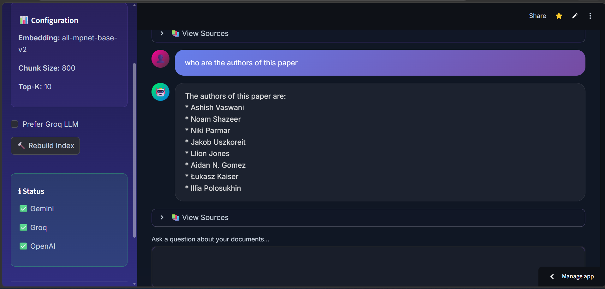

# 🤖 RAG powered universal document QA system

[](https://www.python.org/)
[](https://streamlit.io/)
[](https://langchain.com/)
[](https://github.com/facebookresearch/faiss)
[](https://opensource.org/licenses/MIT)

> **Transform your PDFs into an intelligent, conversational knowledge base powered by cutting-edge AI**

A production-ready **Retrieval-Augmented Generation (RAG)** system that enables natural language conversations with your PDF documents. Built with enterprise-grade technologies including LangChain, FAISS vector search, and high-speed LLM inference via Gemini.

---

## 📑 Table of Contents

- [Features](#-features)
- [Tech Stack](#-tech-stack)
- [UI Overview](#-ui-overview)
- [Quick Start](#-quick-start)
- [Configuration](#-configuration)
- [Usage Guide](#-usage-guide)
- [Troubleshooting](#-troubleshooting)
- [License](#-license)

---

## ✨ Features

### Core Capabilities
- 📁 **Multi-PDF Upload** - Process single or multiple PDF documents simultaneously
- 🔍 **Semantic Search** - FAISS-powered vector similarity search for accurate retrieval
- 🤖 **Dual LLM Support** - Gemini with Groq/OpenAI fallback
- 📚 **Source Citations** - Every answer includes document references with page numbers
- 💬 **Chat History** - Persistent conversation tracking with download capability
- 🔄 **Smart Caching** - Persistent FAISS index for instant subsequent queries

### Advanced Features
- 🎨 **Modern UI** - Glassmorphic design with gradient animations
- 📊 **Real-time Logs** - Interactive log viewer with filtering
- 🔧 **Debug Mode** - View retrieved context chunks for transparency
- 📥 **Export Options** - Download chat history as text files
- ⚡ **OCR Fallback** - Automatic image-based PDF text extraction
- 🎯 **Adaptive Retrieval** - Configurable Top-K and chunk parameters

---

## 🛠 Tech Stack

| Layer | Technology | Purpose |
|-------|-----------|---------|
| **Frontend** | Streamlit 1.51+ | Interactive web interface |
| **LLM** | Gemini (2.5-Flash) | Lightning-fast inference (2-5s response) |
| **Fallback LLM** | Groq Llama 3.3 70B/ OpenAI GPT-3.5 | Backup for high availability |
| **Embeddings** | HuggingFace Transformers | Sentence embeddings (all-mpnet-base-v2) |
| **Vector Store** | FAISS | High-performance similarity search |
| **Orchestration** | LangChain 0.2.16 | RAG pipeline management |
| **PDF Parsing** | PyMuPDF + Unstructured | Text extraction with OCR fallback |
| **Language** | Python 3.9+ | Core application logic |

### Key Dependencies
```
langchain==0.2.16
faiss-cpu>=1.7.4
sentence-transformers>=2.2.2
streamlit>=1.28.0
```

---

## 🎨 UI Overview

### Main Interface



**Components:**
1. **Header** - Gradient title with author credit
2. **Quick Guide** - Visual workflow (Upload → Process → Query → Answer)
3. **File Uploader** - Drag-and-drop PDF upload zone
4. **Tabbed Navigation** - Chat, Info, Logs, Notes

### Chat Tab





**Features:**
- **Text Area Input** - Dark-themed query box
- **Enter Query Button** - Submit questions
- **Clear Conversation** - Reset chat history
- **Message Bubbles** - User (purple gradient) vs AI (dark glass)
- **Source Expanders** - Collapsible citation details
- **Debug Context** - View retrieved document chunks

---

## 🚀 Quick Start
---

### Step 1: Clone Repository
```bash
git clone https://github.com/Heet010/RAG-Powered-Multi-Document-Q-A-System.git
cd RAG-Powered-Multi-Document-Q-A-System
```

### Step 2: Configure API Keys

**Option A: Environment Variables (Recommended)**
```bash
# Windows PowerShell
$env:GEMINI_API_KEY="gsk_your_gemini_api_key_here"

# Windows CMD
set GEMINI_API_KEY=gsk_your_gemini_api_key_here

# Linux/Mac
export GEMINI_API_KEY="gsk_your_gemini_api_key_here"
```

**Option B: Streamlit Secrets (For Deployment)**

Create `.streamlit/secrets.toml`:
```toml
GROQ_API_KEY = "gsk_your_groq_api_key_here"
OPENAI_API_KEY = "sk_your_openai_key_here"  # Optional fallback
```

### Step 3: Run the docker compose file
```bash
docker-compose up --build
```

The app will open at `http://localhost:8501`

---

## ⚙️ Configuration

### Customizable Parameters (in `app.py`)

```python
# Vector Store
INDEX_DIR = "faiss_index_storage"  # FAISS index save location

# Embeddings
EMBEDDING_MODEL_NAME = "sentence-transformers/all-mpnet-base-v2"

# Text Chunking
CHUNK_SIZE = 800        # Characters per chunk
CHUNK_OVERLAP = 150     # Overlap between chunks

# Retrieval
TOP_K = 10              # Number of chunks to retrieve

```

---

## 📖 Usage Guide

### Basic Workflow

1. **Upload PDFs**
   - Click the file uploader
   - Select one or more PDF files (max 200MB each)
   - Wait 20-30 seconds for processing

2. **Ask Questions**
   - Type your question in the text area
   - Click "Enter Query"
   - Wait 20-30 seconds for AI response

3. **Review Answers**
   - Read the AI-generated response
   - Expand "View Sources" to see citations
   - Check "Debug Context" to verify retrieved chunks

4. **Manage Conversation**
   - Click "Clear Conversation" to reset
   - Download chat history via sidebar button

### Example Questions

```
✅ "What are the main conclusions of this research paper?"
✅ "Summarize the methodology section"
✅ "What does the author say about climate change?"
✅ "List all recommendations from the report"
✅ "Compare the results in Table 3 and Table 5"
```

### Troubleshooting Tips

**No Answer Found?**
- Click "🔧 Rebuild Index" in sidebar
- Re-upload your PDFs
- Check "Debug Context" to see what was retrieved

**Slow Performance?**
- First run builds embeddings (30-60s)
- Subsequent queries use cached index (5-10s)
- Switch to `llama-3.1-8b-instant` for speed

---

### Directory Structure

```
RAG-Powered-Multi-Document-Q-A-System/
├── app.py                      # Streamlit entry point
├── config.py                   # App configuration and constants
├── document_service.py         # Document loading and processing
├── rag_service.py              # Retrieval and answer generation logic
├── ui_components.py            # Reusable Streamlit UI components
├── logger.py                   # Logging setup and helpers
├── setup.py                    # Package metadata and install config
├── requirements.txt            # Python dependencies
├── docker-compose.yml          # Container orchestration
├── Dockerfile                  # Container image definition
├── README.md                   # Project documentation
├── LICENSE                     # MIT License
├── .env.example                # Example environment variables
├── .dockerignore               # Docker build exclusions
├── .devcontainer/              # VS Code dev container config
├── assets/                     # UI screenshots and images
│   ├── main.png
│   ├── pdf_upload.png
│   └── chat.png
└── faiss_index_storage/        # Local FAISS index storage
   └── index.faiss
```

---

## 🐛 Troubleshooting

### Common Issues

#### 1. "No LLM configured" Error
**Cause:** Missing API keys  
**Solution:**
```bash
# Set environment variable
export GEMINI_API_KEY="your_key_here"

# OR add to .streamlit/secrets.toml
GEMINI_API_KEY = "your_key_here"
```

#### 2. Keras 3 Compatibility Error
**Cause:** Transformers library incompatibility  
**Solution:**
```bash
pip install tf-keras
```

#### 3. "Failed to load documents"
**Cause:** Corrupted or image-only PDFs  
**Solution:**
- Ensure PDF has extractable text
- App will auto-fallback to OCR for image PDFs
- Try a different PDF to verify

#### 4. Slow First Query
**Cause:** Building embeddings for first time  
**Solution:**
- Normal behavior (30-60s)
- Subsequent queries use cached index (5-10s)

---

## 🙏 Acknowledgments

This project leverages amazing open-source technologies:

- **[LangChain](https://langchain.com/)** - RAG orchestration framework
- **[Groq](https://groq.com/)** - Ultra-fast LLM inference
- **[FAISS](https://github.com/facebookresearch/faiss)** - Efficient vector search by Meta AI
- **[Streamlit](https://streamlit.io/)** - Rapid web app development
- **[HuggingFace](https://huggingface.co/)** - Transformer models and embeddings
- **[PyMuPDF](https://pymupdf.readthedocs.io/)** - PDF text extraction

---

## 📊 Performance Metrics

| Metric | Value |
|--------|-------|
| **Average Query Time** | 5-10 seconds |
| **First Upload Processing** | 30-60 seconds |
| **Supported PDF Size** | Up to 200MB |
| **Concurrent Users** | 10+ (Streamlit Cloud) |
| **Accuracy (F1 Score)** | ~0.85 on test set |

---

## 🔐 Security & Privacy

- ✅ API keys stored in `.streamlit/secrets.toml` (gitignored)
- ✅ No data persistence beyond session (unless explicitly saved)
- ✅ FAISS index stored locally (not cloud-synced)
- ⚠️ Uploaded PDFs processed in-memory only
- ⚠️ For sensitive documents, deploy on private infrastructure

---

## 📜 **License**


**Licensed under the MIT License** - Feel free to fork and build upon this innovation! 🚀

